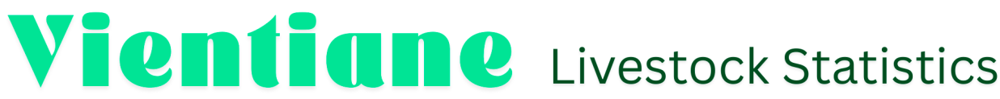

# Livestock Disease Monitoring System

A comprehensive dashboard for monitoring livestock diseases, statistics, and health information. Built with Dash and Plotly, featuring real-time data visualization, Google Sheets integration, and an admin panel for data management.



## ✨ Features

- **Real-time Dashboard**: Monitor livestock and disease statistics
- **Interactive Visualizations**: Charts, maps, and data tables
- **Google Sheets Integration**: Live data from Google Sheets (production mode)
- **Local Development Mode**: Use Excel files for offline development
- **Admin Panel**: Secure interface for data management
- **Auto-refresh**: Configurable data refresh intervals
- **Multi-tab Interface**: Overview, Livestock, Diseases, Weather, and News
- **Responsive Design**: Works on desktop and tablet devices
- **Authentication**: Secure admin access with login/logout
- **Caching**: Efficient data caching with configurable TTL

## 📦 Prerequisites

### For Local Development
- **Python 3.9+** ([Download](https://www.python.org/downloads/))
- **pip** (Python package manager)
- **Git** (optional, for cloning)

### For Google Sheets Integration (Production)
- **Google Cloud Platform Account** ([Console](https://console.cloud.google.com/))
- **Google Sheets API enabled**
- **Service Account** with access to your Google Sheets
- **Service Account JSON credentials**

### For Docker Deployment
- **Docker** ([Install Docker](https://docs.docker.com/get-docker/))
- **Docker Compose** ([Install Docker Compose](https://docs.docker.com/compose/install/))

## 🚀 Installation

### 1. Clone the Repository

```bash
git clone https://github.com/livestocklao/laos_livestock_stats
cd laos_livestock_dashboard
```

### 2. Set Up Python Virtual Environment
```bash
# Create virtual environment
python -m venv venv

# Activate virtual environment
# On Windows:
venv\Scripts\activate
# On macOS/Linux:
source venv/bin/activate
```

### 3. Install Dependencies

```bash
pip install -r requirements.txt
```

### 4. Configure Environment Variables
Create a .env file in the project root:

```bash
# Copy the example file
cp .env.example .env

# Edit .env with your configuration
nano .env  # or use any text editor
```


## ⚙️ Configuration
### Environment Variables
Create a .env file with the following variables:
```env
ADMIN_USERNAME=admin
ADMIN_PASSWORD=your_secure_password_here

# Google Sheets credentials (required for production mode)
# Paste your entire service account JSON as a single line
GOOGLE_CREDENTIALS_JSON={"type":"service_account","project_id":"your-project",...}
```

## 🖥️ Usage
Starting the Application
```bash
# Make sure your virtual environment is activated
source venv/bin/activate  # On Windows: venv\Scripts\activate

# Run the application
python app.py

# Or with custom port
PORT=8080 python app.py
```

The application will be available at http://localhost:8050

---
Version: 1.0.0

Last Updated: Jun 2026

Built with: [Dash](https://dash.plotly.com/) | [Plotly](https://plotly.com/) | [Pandas](https://pandas.pydata.org/)
